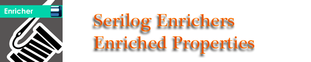

#


Enriches [Serilog](https://serilog.net) events with information from logger properties that was enriched earlier.
 
## Getting Started

To use the enricher:

1. Install the [NuGet package](https://www.nuget.org/packages/Serilog.Enrichers.EnrichedProperties/):

    ```powershell
    Install-Package Serilog.Enrichers.EnrichedProperties
    ```

2. Then, apply the enricher to your `LoggerConfiguration` with formated, for example, the [console sink](https://github.com/serilog/serilog-sinks-console), the [file sink](https://github.com/serilog/serilog-sinks-file) or the [email sink](https://github.com/serilog/serilog-sinks-email) etc. `outputTemplate` configuration parameter:

    ```csharp
    Log.Logger = new LoggerConfiguration()
        .Enrich.WithProperty("Test property", "Added") // for example
        .Enrich.With... // ... other Enrichers here
        .Enrich.WithEnrichedProperties()
        // ...other configuration...
        .WriteTo.Console(outputTemplate:
            "[{Timestamp:HH:mm:ss} {Level:u3}] {Message:lj}{NewLine}{Exception}{NewLine}Enriched properties:{NewLine}{EnrichedProperties}")
        .WriteTo.File("log.txt", outputTemplate: 
            "[{Timestamp:HH:mm:ss} {Level:u3}] {Message:lj}{NewLine}{Exception}{NewLine}Enriched properties:{NewLine}{EnrichedProperties}")
        .WriteTo.Email(outputTemplate:
            "[{Timestamp:HH:mm:ss} {Level:u3}] {Message:lj}{NewLine}{Exception}{NewLine}Enriched properties:{NewLine}{EnrichedProperties}",
            fromEmail: "app@example.com",
            toEmail: "support@example.com",
            mailServer: "smtp.example.com")
        .CreateLogger();
    ```

    Where built-in the enricher property is `EnrichedProperties` in output templates.

    The `WithEnrichedProperties()` enricher will add properties from logger that was enriched earlier to produced events.

#

For example, the output text in file `log.txt` will be:
```
[23:12:28 INF] Has an EnrichedProperties property with properties that was enriched earlier

Enriched properties:
Test property: "Added"
```

### Included enrichers

The package includes:

 * `WithEnrichedProperties()` - adds properties from logger that was enriched earlier.

## Builds status

|Status|Value|
|:----|:---:|
|Build|[](https://ci.appveyor.com/project/unchase/serilog-enrichers-enrichedproperties)
|Tests|[](https://ci.appveyor.com/project/unchase/serilog-enrichers-enrichedproperties/build/tests)
|Buid History|
|GitHub Release|[](https://github.com/unchase/serilog-enrichers-enrichedproperties/releases/latest)
|GitHub Release Date|[](https://github.com/unchase/serilog-enrichers-enrichedproperties/releases/latest)
|GitHub Release Downloads|[](https://github.com/unchase/serilog-enrichers-enrichedproperties/releases/latest)
|Nuget Version|[](https://www.nuget.org/packages/serilog.enrichers.enrichedproperties/) 
|Nuget Downloads|[](https://www.nuget.org/packages/serilog.enrichers.enrichedproperties/)

## Feedback

Please feel free to add your [request a feature](https://github.com/unchase/serilog-enrichers-enrichedproperties/issues/new?title=FEATURE) or [report a bug](https://github.com/unchase/serilog-enrichers-enrichedproperties/issues/new?title=BUG). Thank you in advance!

## Thank me!

If you like what I am doing and you would like to thank me, please consider:

[](https://www.buymeacoffee.com/nikolaychebotov)

Thank you for your support!

----------

Copyright &copy; 2019 [Nikolay Chebotov (**Unchase**)](https://github.com/unchase) - Provided under the [Apache License 2.0](LICENSE).
